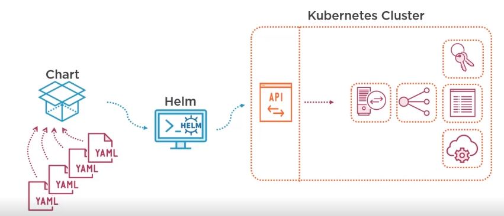
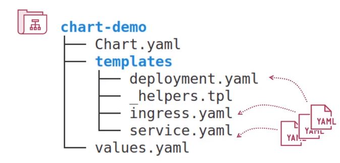

# Helm - Packaging applications with Helm for K8s

- Why Helm?
  - Helps in Packing of diff K8s components - ex - pods,deployments,services, pv,pvc,secrets, configmaps..etc
  - Easy Versioning - which helps in easy updates and rollbacks.
  - Customization
  - Dependencies - order in which diff components to k8s to be deployed.
  
- What is Helm?
  - A package manager for K8s.
  - ex:- maven - jar , npm - nodemodules, pip - python packages, Helm -charts
  - Heres is how helm works.
  - 
  - Helm-Charts are the definition of your application and release is the instance of these charts.
  - Helm stores release manifest in K8s as secrets
  - Helm uses a Three way merge patches for update

## Helm chart-
  - Helm Chart structure-  
  - Chart version - this is usually changed only when there is a change in chart structure.
    - The version follows major.minor.patch vresion index ex:- (0.1.0),(1.0.0);

## Helm Templates
  - Why Helm Templates>
    - Remove hardcoded values from K8s Components ex:-image version,port values etc
    - Append namespaces/env info to the k8s comp so that we have env based deployments ex:- dev,test,prod etc..
  - Helm Template Engine
    - Its based on GO template engine where the values in objects replace the ``` {{.Values.name}} ``` in the templates.
  - Testing Helm Template
    - ``` helm template [chart] ``` 
      - works without K8s cluster 
      - static release name
    - ``` helm install [release] [chart] --dry-run --debug ``` 
      -  real helm instlal but without commit
      -  can generate a release-name
   - Providing values for helm templates
     - values.yaml - placed at root of the charts
     - otherfile.yaml - helm install -f otherfile.yml
     - variables - helm install --set goo=bar
     - hierarchically organized in case of umbrella charts
   - values.schema.json file helps to validate the values schema
   - Helm Built in object properties
     - Chart Data- you can read the chart.yaml values using the ``` {{.Chart.Name}} ``` - note the .Chart.Name refers to chart.yaml name property
     - Release Data - ```{{.Release.Revision}}```
     - Kubernetes Data - ex:- ``` {{.Capabilities.KubeVersion}} ```
     - File data- ex:- ``` annotation: data:{{.Files.Get conf.ini}} ``` - accesing conf.ini at the root of charts
   - In case of umbrella charts the root values.yaml overrides thechild value.yaml in case of overlap of properties
   - ```global``` property in root values.yaml is accessable by all child charts
   - ### Helm Template Functions and Pipelines
     -  https://helm.sh/docs/chart_template_guide/functions_and_pipelines/
     -  modifying scope property using ``` with ```